# getting started with Robust, in Excel
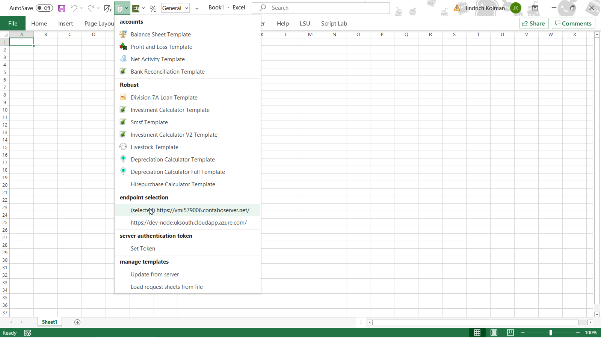
After installing LSU, first thing is to select the right Robust server.

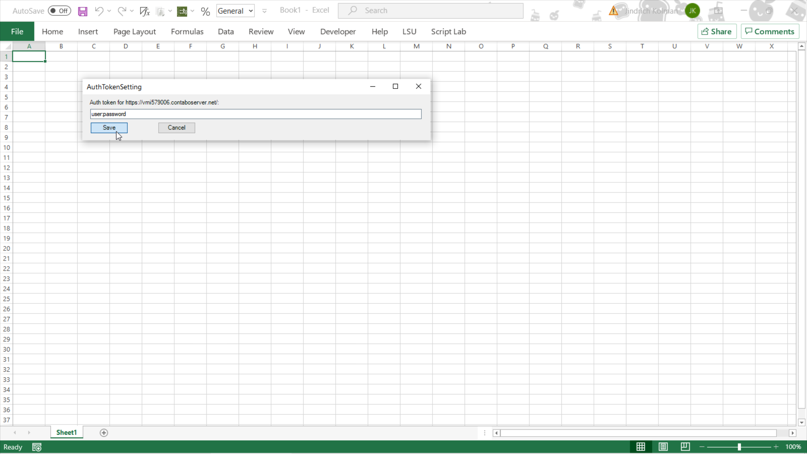
Enter your credentials, joined by a `:`, like this: `username:password`.

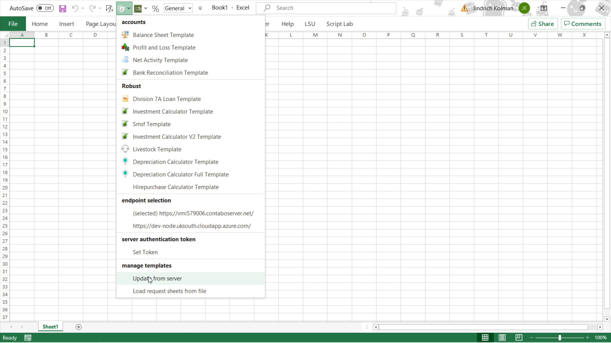
It's also a good idea to update template data, unless you just want to run requests on existing excel files. Note: unfortunately, it's not persistent yet, so you'll need to do it again if you close Excel.

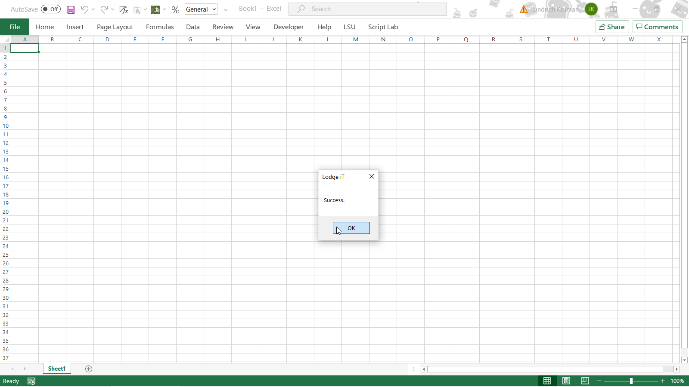
Yay!

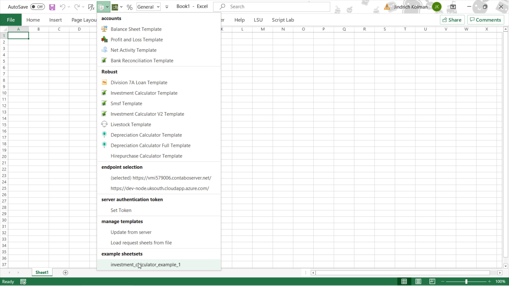
Finally, we can load an example. This one contains a medium-sized set of example bank statements and some other data.

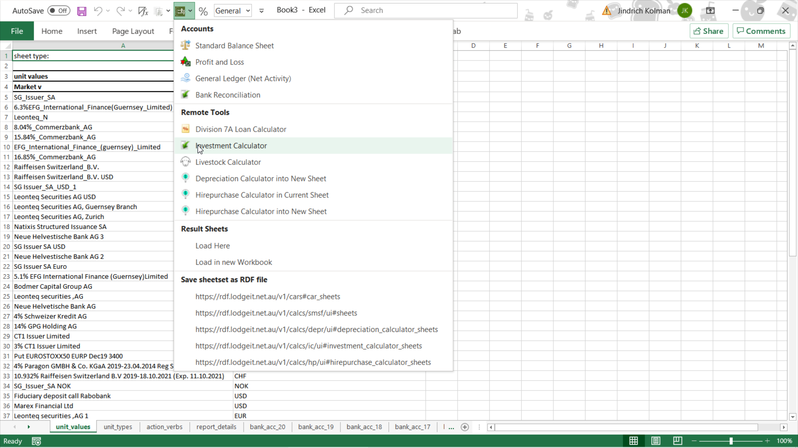
Now it's time to tell the server to process it.

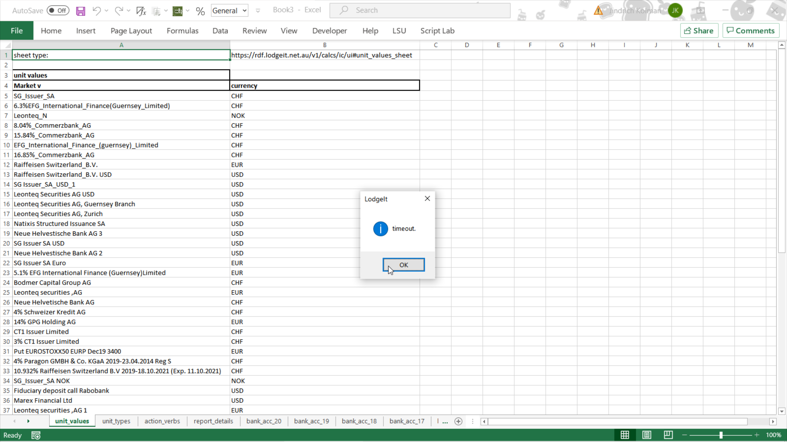
Excel will wait a while and then give up, because this example keeps the server busy for anywhere between 3 and 10 minutes. But this is not a problem.

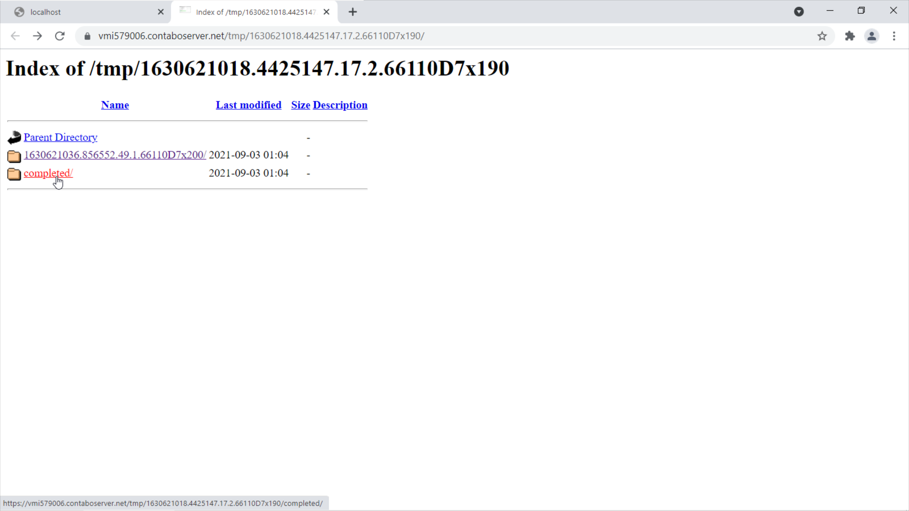
A browser window opens automatically. Wait a few minutes and hit F5 until `completed` appears. There will eventually be a way to manage long-running requests better :-)

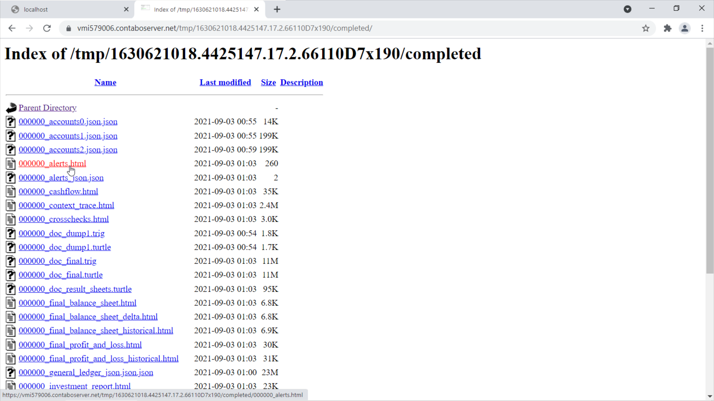
 This is a directory where all reports, as well as various machine-readable files, are saved. You should always check the alerts file. If any issues were detected, they will be noted here. In this case, it says `no alerts.`, so we move on.

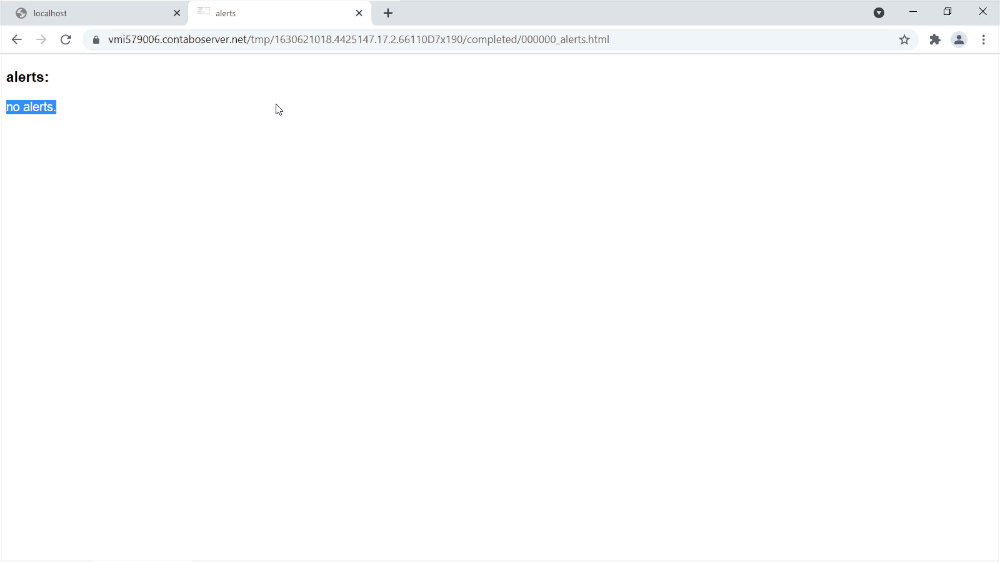
Good.

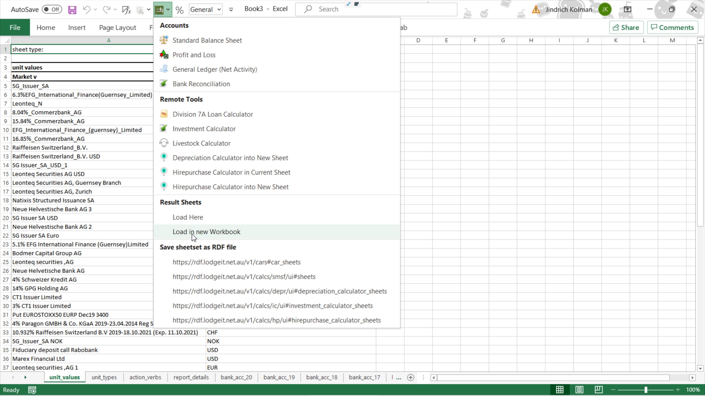
Going back to excel, we can now load any result sheets produced:

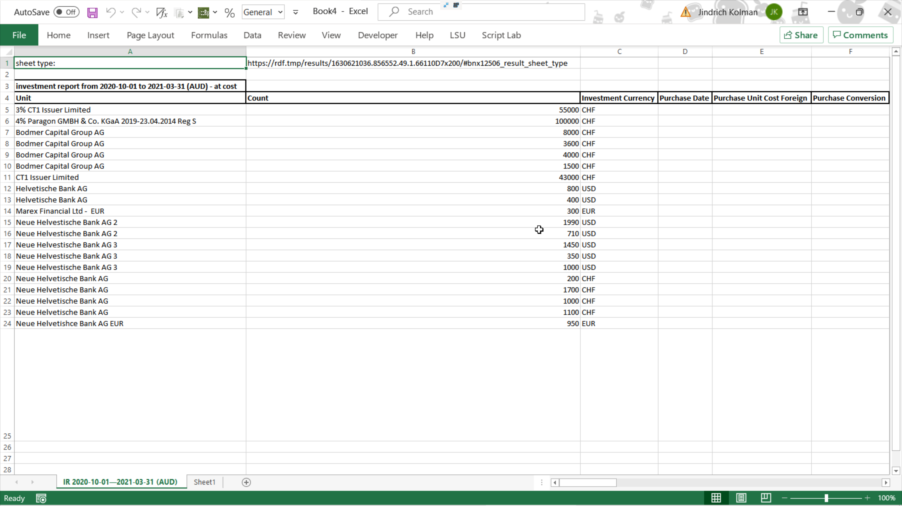
This is the excel version of the investment report, that you can also find among the html files. Nice!

